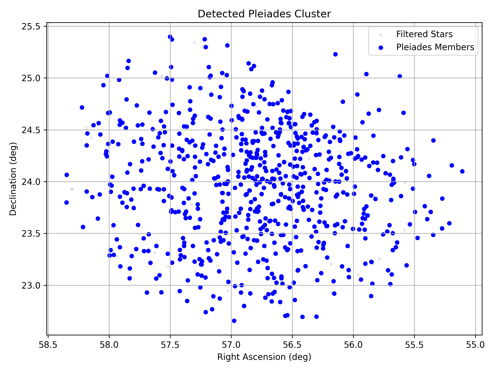
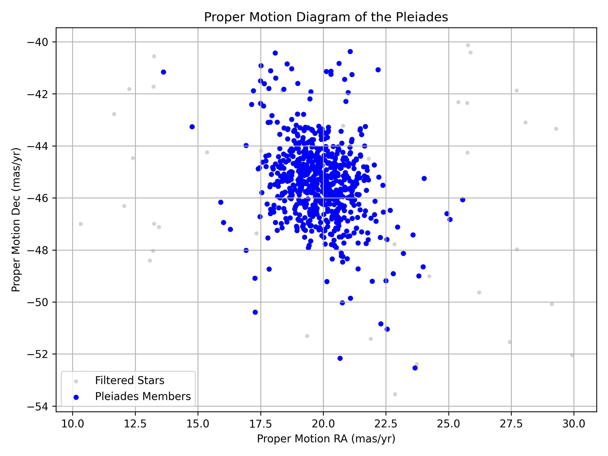
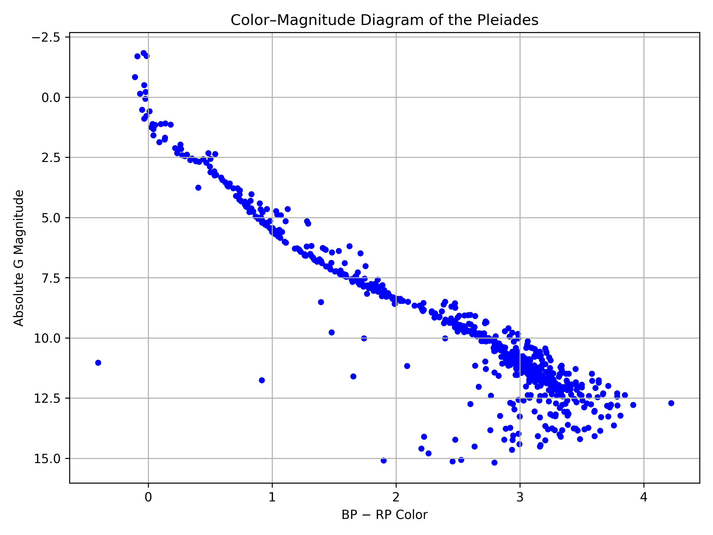

# Analysis of the Pleiades Open Cluster Using Gaia DR3 Data

## Overview

This project analyzes the Pleiades Open Cluster using Gaia Data Release 3 (Gaia DR3). The analysis includes data cleaning, cluster identification using DBSCAN, statistical analysis, and scientific visualization.

---

## Workflow

Gaia DR3 FITS Data
⬇
Data Cleaning
⬇
Manual Filtering
⬇
DBSCAN Clustering
⬇
Statistical Analysis
⬇
Scientific Visualizations


#Features

- Read Gaia DR3 FITS data
- Clean astronomical data
- Detect cluster members using DBSCAN
- Calculate cluster statistics
- Generate a sky map
- Plot proper motion diagram
- Plot color–magnitude diagram (CMD)
- Generate statistical histograms

## Project Structure

```
main.py
read_data.py
clean_data.py
cluster_detection.py
cluster_statistics.py
sky_map.py
proper_motion_diagram.py
color_magnitude_diagram.py
```

---

## Sky Map



---

## Proper Motion Diagram



---

## Color–Magnitude Diagram



## Requirements

- Python 3.10+
- NumPy
- Matplotlib
- Astropy
- Scikit-learn

Install dependencies:

```bash
pip install -r requirements.txt
```
---

## Results

- ⭐ 50,000 stars loaded
- ⭐ 42,732 cleaned stars
- ⭐ 680 cluster members detected
- ⭐ Mean distance ≈ 135 pc

---

## Author

**Nunna Satyanarayana**  
BS–MS 2024 (Physics)  
Indian Institute of Science Education and Research Tirupati
